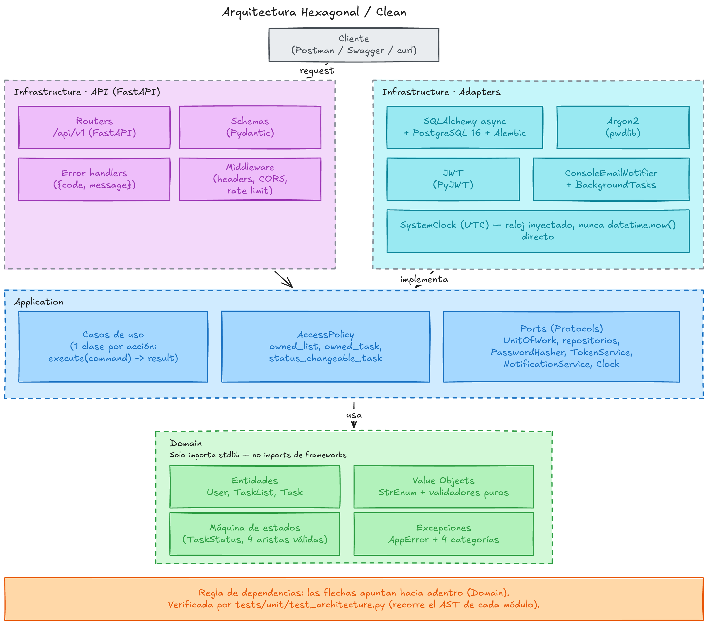
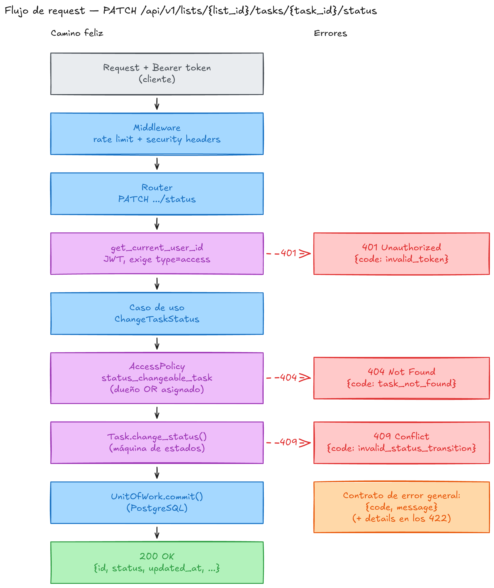
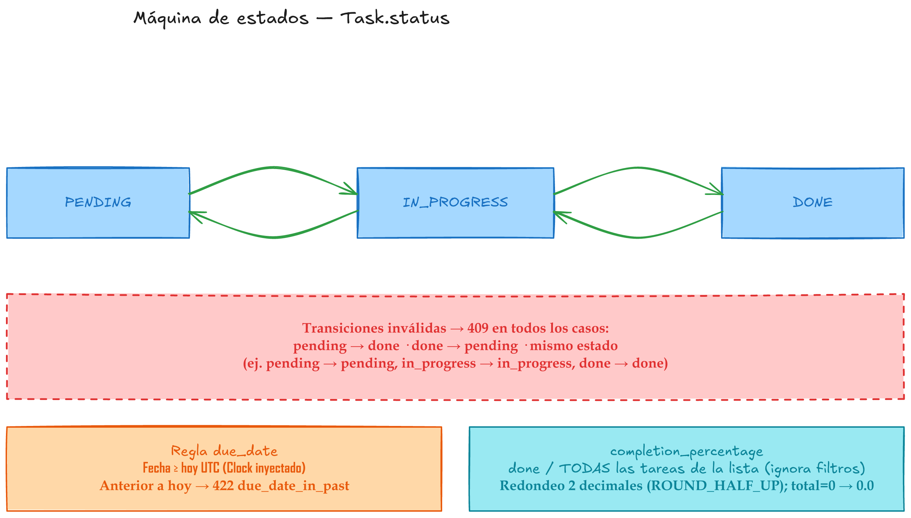
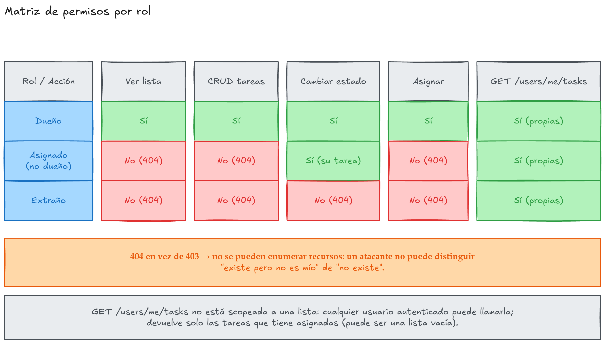

# Diagrams

Four reference diagrams for [`../how-it-works.md`](../how-it-works.md). All
labels are in Spanish; this index and the rest of the docs are in English.
Each diagram ships as a `.png` (for embedding), an `.svg` (for crisp
zoom/print), and an `.excalidraw` (the editable source).

| Diagram | Preview | Covers |
|---|---|---|
| 01 — Architecture |  | Hexagonal/Clean layers (Domain / Application / Infrastructure) and the dependency rule |
| 02 — Request flow |  | Step-by-step life of a `PATCH .../status` request, including where 401/404/409 come from |
| 03 — Status state machine |  | The four valid `Task.status` transitions, the `due_date` rule, and `completion_percentage` |
| 04 — Permissions matrix |  | What an owner, an assignee, and a stranger can each do, and why 404 replaces 403 |

## Editing

Each diagram's `.excalidraw` file is the source of truth; regenerate the
`.png`/`.svg` after any edit.

- **Web**: open [excalidraw.com](https://excalidraw.com), use **Open** (or
  drag the file in), edit, then **Export image** as both PNG and SVG back
  into this folder.
- **VS Code**: install the
  [Excalidraw extension](https://marketplace.visualstudio.com/items?itemName=pomdtr.excalidraw-editor)
  and open the `.excalidraw` file directly in the editor.
